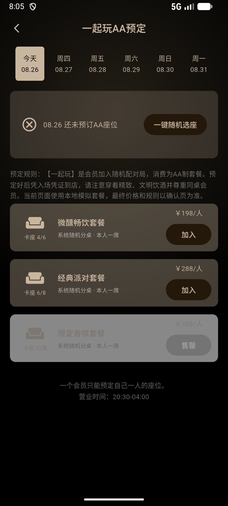
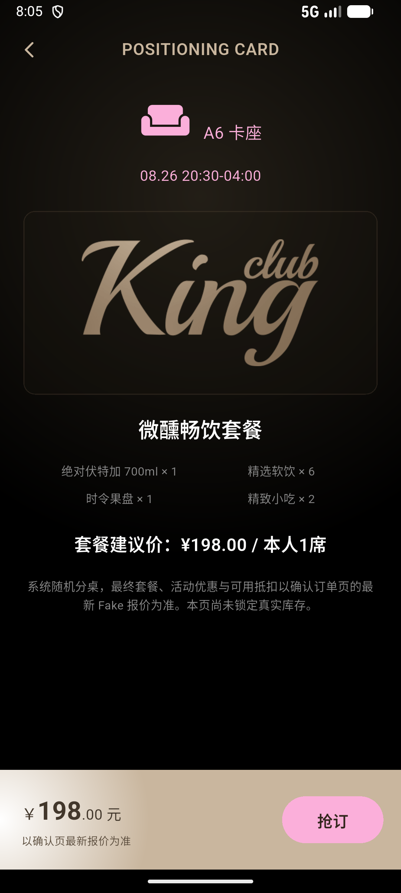
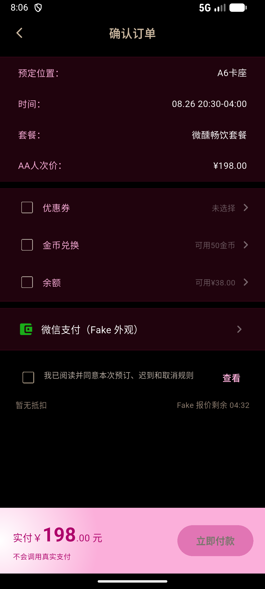
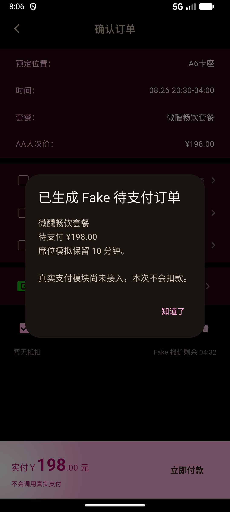

# 一起玩 AA UI/Mock 审计

- 日期：2026-08-28
- 范围：KC-P-027～029
- 设备：Android Emulator，1080×2400
- 用户目标：从首页进入一起玩，选择套餐、核对报价并安全得到本地 Fake 待支付结果
- 结论：通过 UI/Mock 验收；真实服务接入继续阻断

## 1. 预订列表 — 健康

- 日期条、未预订状态、随机推荐、套餐卡、售罄灰态和返回入口均清晰可达。
- 可订与售罄按钮状态可见；一人一席与营业时间说明保留。
- 规则正文使用旧版低亮度层级，在强光或低亮度设备上仍有对比度风险，后续整 App 无障碍轮次需实测。

## 2. 套餐详情 — 健康

- 卡座、时间、品牌素材、套餐内容、价格说明和固定“抢订”入口层级稳定。
- 页面明确提示最终金额以确认页 Fake 报价为准，没有暗示库存已锁定。
- 截图只能确认当前字号；200% 字体与读屏顺序由 Widget 测试和后续辅助技术实测继续覆盖。

## 3. 确认订单 — 健康（已修正）

- 订单摘要、三种抵扣、Fake 支付外观、规则确认、倒计时和固定实付栏完整。
- “立即付款”在规则未同意时禁用，避免误提交。
- 本轮发现三个抵扣复选框缺少 Android 语义名称；已补为“优惠券/金币兑换/余额 + 当前详情”，并加入自动化断言。

## 4. Fake 待支付结果 — 健康

- 结果明确写出待支付金额、席位保留时间与“真实支付模块尚未接入，本次不会扣款”。
- 没有宣称支付成功，也没有调用真实支付、超级接口或库存服务。

## 自动化与证据边界

- `test/aa_reservation_flow_test.dart`：15/15 通过。
- 完整 Widget 回归：246/246 通过。
- `flutter analyze`：0 问题。
- 截图可验证视觉层级和当前设备布局，不能单独证明完整 WCAG 合规、真实支付行为、网络并发或服务端库存一致性。
