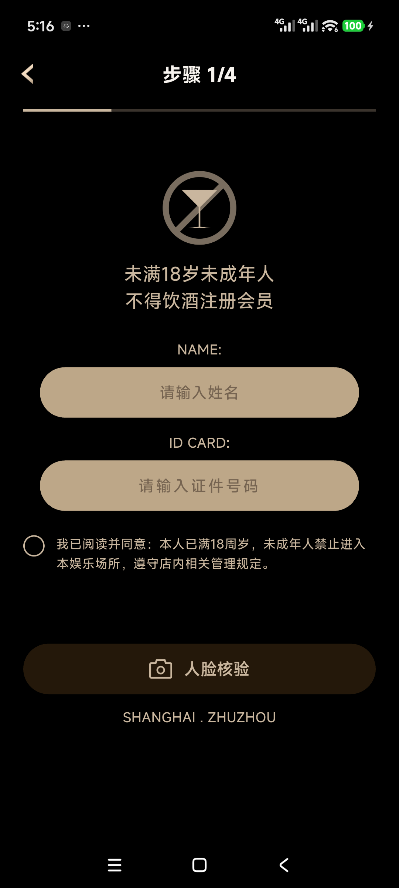
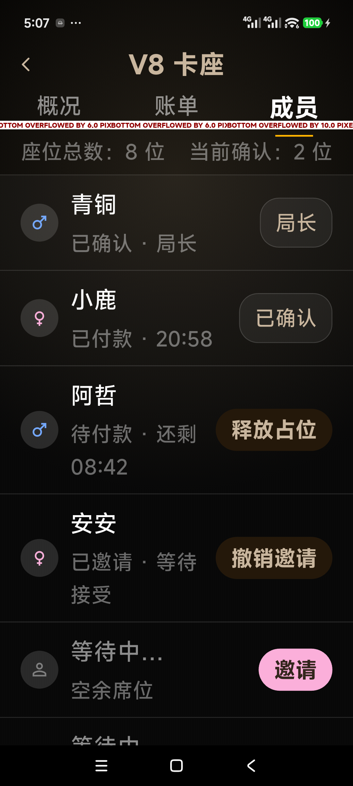
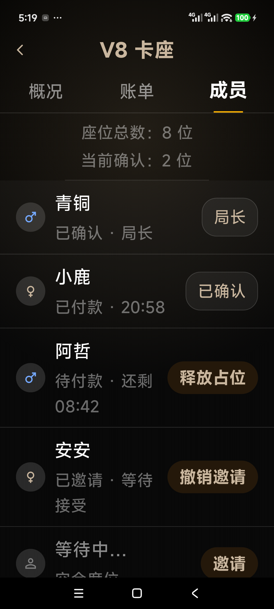
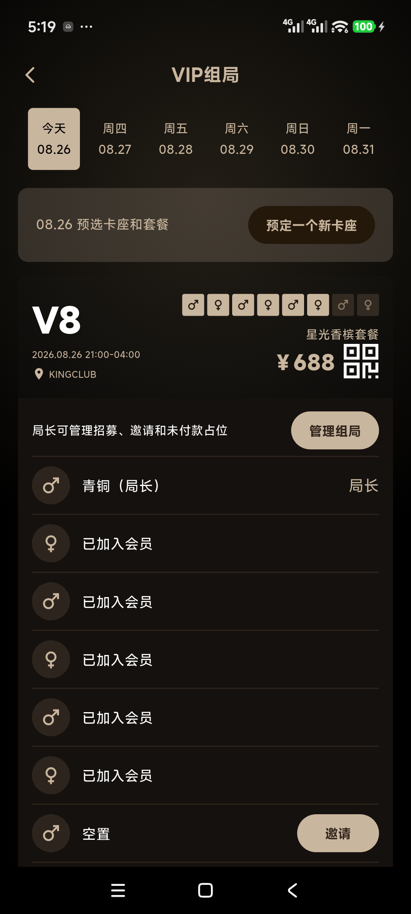
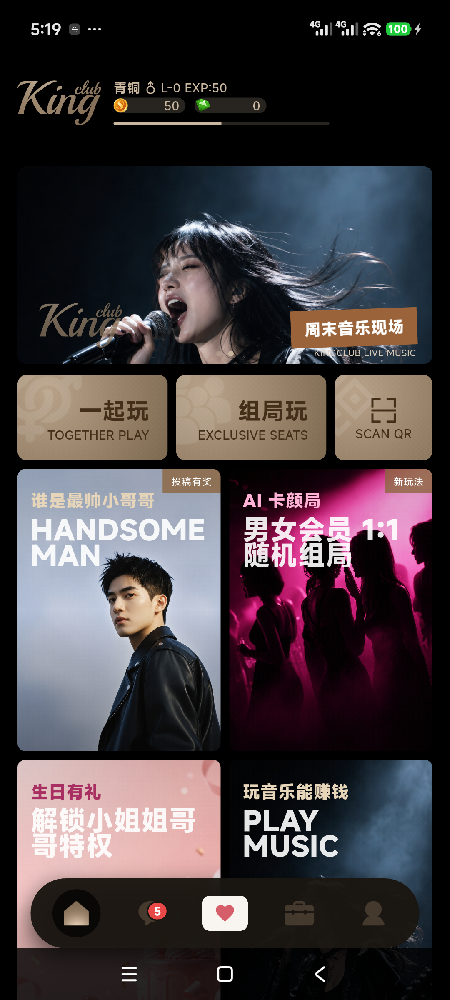

# 第 4 阶段：Android 多尺寸、大字体与返回路径验收

- 真机：Android，物理分辨率 1440 × 3200；验收覆盖窗口 1080 × 2400，密度 420。
- 自动化视口：360 × 800、393 × 852、430 × 932。
- 字体缩放：100%、130%、200%。

## 证据

### 成年声明恢复

实名页已恢复黑金色圆形声明控件与完整文案；控件和首行文字顶部对齐，未勾选时不能进入 Fake 核验。

### 200% 字体修复前后

修复前管理 Tab 出现 6～10 px Flutter 溢出警告；修复后 Tab、成员摘要、成员行和操作按钮均无红色溢出，可通过纵向滚动访问。

### Android 系统返回

返回序列符合批准规范：局长管理页返回 VIP 详情/列表内联态，VIP 分支根返回首页；首页再次返回交给 Android 平台退出/后台，不返回登录流程。

## 自动化结果

- `flutter analyze`：通过，无问题。
- `flutter test --no-pub`：294/294 通过。
- App Shell 在三种视口与 100%/130%/200% 字体下保持五个目标至少 48dp 可点击区域。
- 首页三项核心动作在三种视口、200% 字体下无异常。
- VIP 管理页新增 393 × 852、200% 字体专项回归。

最终结果：`PASS`。
