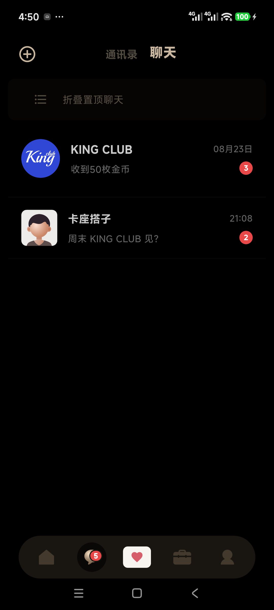
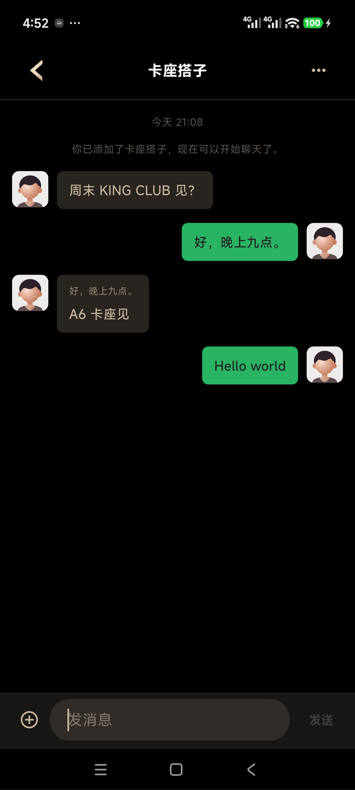
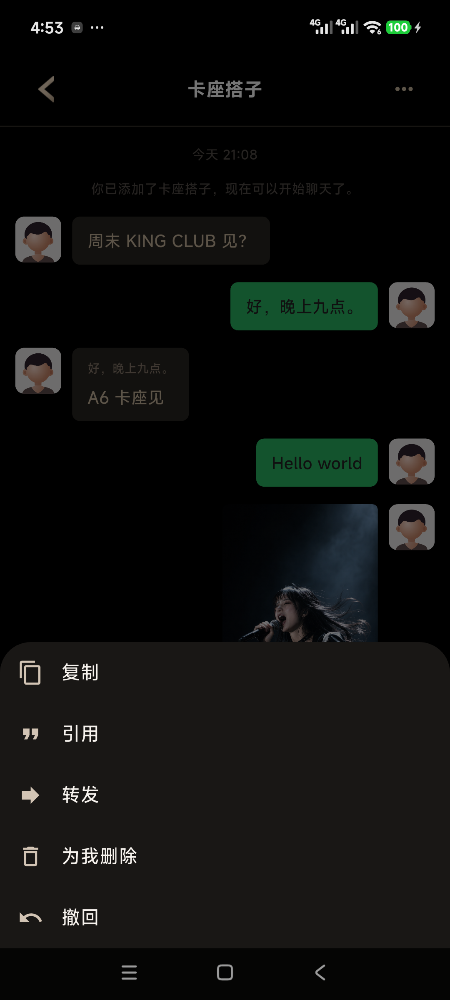
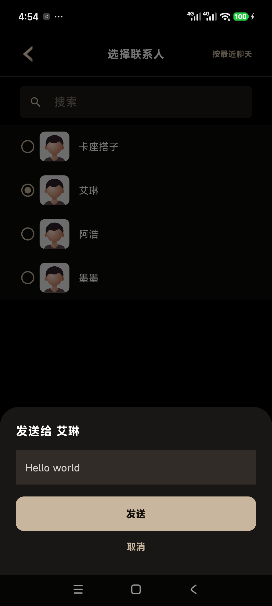
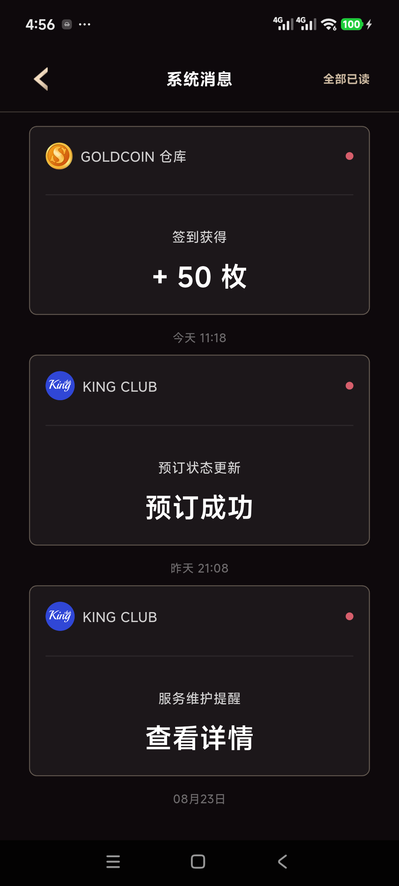
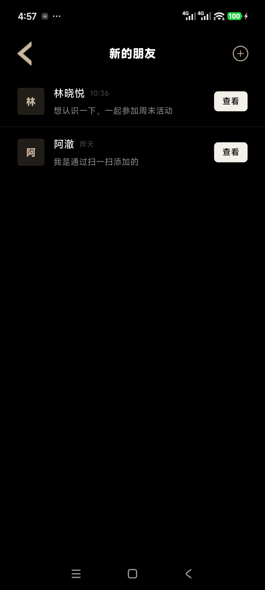
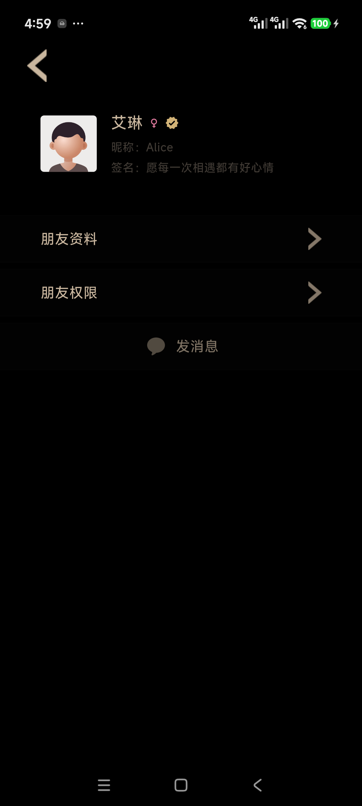
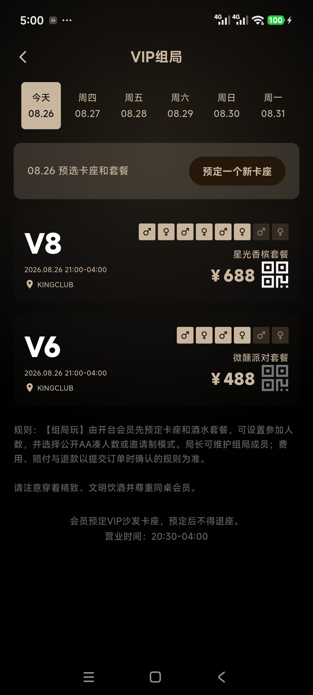
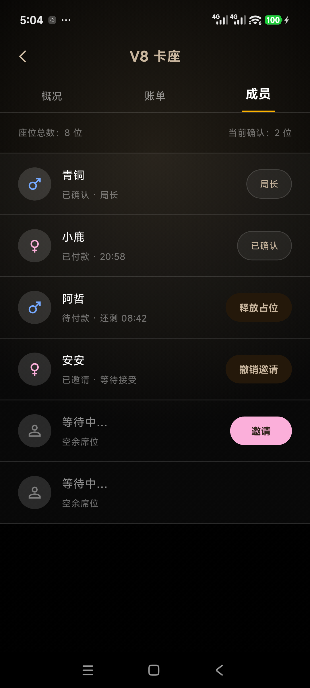

# KINGCLUB APP V2 五阶段 UI 验收

- 日期：2026-08-29
- 范围：当前冻结的 48 个 App 页面及其 UI/Mock 主流程、异常状态与返回路径
- 构建：`previewDebug`，仅 Mock/Fake；没有接入真实超级接口、WebSocket、支付、推送或生产 SDK
- 结论：`Technical UI QA PASS — Ready for User UI Flow Approval`

## 总览

| 阶段 | 范围 | 结果 |
|---|---|---|
| 1 | 会话列表、单聊、发送、图片、长按、转发、详情与清空 | PASS |
| 2 | 系统通知、通讯录、好友申请、添加好友与用户主页 | PASS |
| 3 | VIP 组局列表、创建、详情、账单与局长成员管理 | PASS（2 个 P1 已修复） |
| 4 | Android 多尺寸、200% 字体、系统返回与实名声明复验 | PASS（2 个 P1 已修复） |
| 5 | 全量自动化、静态分析与全局门禁评估 | 技术验收通过，等待用户明确批准 |

## 阶段 1：聊天链路

已验收：消息从上至下排列；输入框不挤压消息区；Fake 文本与图片发送、预览、长按、复制/引用/撤回、选择好友转发、聊天详情及清空确认均可达。未发现剩余 P0/P1/P2。

## 阶段 2：好友与通知

已验收：系统通知展开、全部已读与角标联动；好友申请详情与接受结果；添加好友二维码；好友主页到聊天入口。未发现剩余 P0/P1/P2。

## 阶段 3：VIP 组局

发现并修复：创建/管理残留粉色；200% 字体下管理 Tab 和成员布局溢出。详见 [阶段 3 审计](03-vip/audit.md)。复验后无剩余 P0/P1/P2。

## 阶段 4：设备与返回

三种常见 Android 逻辑视口、100%/130%/200% 字体及真机系统返回均通过；实名页遗漏的成年声明已恢复。详见 [阶段 4 审计](04-device-back/audit.md)。

## 阶段 5：门禁评估

### 强项

- 旧版关键视觉层级已稳定复刻，首页、点单/结算、AA、VIP、聊天和个人中心使用一致黑金主题。
- 主流程不是静态截图：输入、滚动、Tab、确认层、列表状态和返回路径均使用可操作 Fake 数据。
- 294 项测试覆盖登录准入、五 Tab、聊天、好友、组局、点单、订单、支付、资产、设置及异常状态。

### UX 与可访问性风险

- `P3`：旧版复刻使用较多低对比度灰金文字；普通字号可读，但在强光环境下仍可能偏弱。进入正式设计优化阶段时应以不破坏旧版视觉为前提提高对比度。
- `P3`：200% 字体通过可达性与无溢出门禁，但部分信息密度较高的页面需要滚动，不能保持旧版单屏密度。
- `P3`：Android 系统字体栅格化与旧微信小程序/iOS 截图存在轻微差异。

### 限制

- 本轮只验证 Flutter UI/Mock，不证明真实网络、WebSocket、支付、相册/相机生产权限和服务端一致性。
- iOS 真机尚未执行同等视觉与返回手势验收；正式发布前仍需补充。
- 首页根页再次按系统返回会按 Android 规范退出/回到上一个应用，这是批准的根页行为。

## 门禁结论

当前技术证据满足 `UI Flow Approved` 的工程前置条件，没有剩余 P0/P1/P2 UI 阻断项。由于项目规则要求用户明确完成整 App UI 验收，本报告将状态保持为“可批准”，真实超级接口、WebSocket、支付及生产 SDK 仍为 `Blocked`；只有用户明确确认后才可将项目账本改为 `UI Flow Approved` 并规划真实接入。
